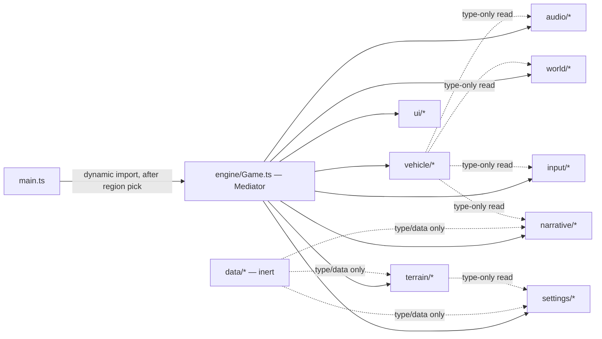

# Architecture Spine — Shamal

`[ASSUMPTION]` This spine documents the architecture as built, derived by reading the
real source tree (import graph, composition, persistence, build config) rather than
proposing a new design — per Fast-path, full-autonomy mode carried over from the
brief, PRD, and UX spines. Every AD below was verified against the actual code, not
asserted from `CLAUDE.md`'s intent alone; where the two disagree, the code wins and the
disagreement is noted.

## Design Paradigm

`src/engine/Game.ts` is a **Mediator**: the single composition root that constructs,
wires, and drives every other system. Every other module (`vehicle/`, `world/`,
`terrain/`, `audio/`, `narrative/`, `ui/`, `input/`, `settings/`) is a **Colleague** —
single-purpose, independently constructible, and forbidden from importing another
Colleague's behavior (AD-2). `Game` runs a classic browser game loop: a
`requestAnimationFrame` render tick wrapping a fixed-timestep Rapier physics step
(AD-4). This is not ECS (no generic entity/component data model) and not a full
scheduler/DI framework — it is a hand-wired mediator, which is the right weight for a
single-scene, single-player game with a fixed, known set of systems.



## Invariants & Rules

### AD-1 — Single composition root

- **Binds:** all modules under `src/`
- **Prevents:** two systems independently deciding to construct or own each other,
  producing duplicate instances or hidden lifecycle coupling.
- **Rule:** only `src/engine/Game.ts` (and `src/main.ts`, which constructs `Game`
  itself after the region picker resolves) may call `new` on a system class from
  `vehicle/`, `world/`, `terrain/`, `audio/`, `narrative/`, `ui/`, or `input/`. `[ADOPTED]`
  — verified: no file in the tree imports `engine/Game`.

### AD-2 — Colleagues exchange state by type only, never by instance

- **Binds:** `vehicle/`, `world/`, `terrain/`, `audio/`, `narrative/`, `ui/`, `input/`,
  `settings/`
- **Prevents:** sibling systems calling into each other directly, which would make the
  Mediator's wiring order load-bearing in ways a future builder can't see from
  `Game.ts` alone, and would let a system silently depend on another system's internal
  behavior instead of its declared state shape.
- **Rule:** a Colleague may `import type { ... }` another Colleague's exported state
  shapes (e.g. `VehicleTelemetry`, `WheelState`, `PoiKind`, `BodyId`, `RegionId`) to
  type its own parameters. It may never import a value/class/function that constructs
  or mutates another Colleague. `Game.ts` reads one Colleague's output and passes it as
  a parameter to another's `update()` — Colleagues never reach across to fetch it
  themselves. `[ADOPTED]` — verified: `vehicle/` imports nothing from `world/ui/
  narrative`; `world/Avalanche.ts`'s one cross-import (`vehicle/Vehicle`'s
  `WheelState`) is type-only; `narrative/Director.ts` imports `vehicle/world/terrain`
  types only, never their instances.

### AD-3 — `data/` is inert

- **Binds:** `src/data/*`
- **Prevents:** game logic leaking into what should be swappable content tables (POI
  coordinates, Ahmed's line pools), which would make content changes require touching
  behavioral code.
- **Rule:** `data/` files export constants and types only — no classes, no functions
  with side effects, no imports from any behavioral module (`engine/`, `vehicle/`,
  `world/`, `terrain/` logic, `audio/`, `narrative/`, `ui/`, `input/`). Any module may
  import from `data/` freely. `[ADOPTED]`.

### AD-4 — One physics clock, owned by the Mediator

- **Binds:** `engine/Game.ts`, `vehicle/*`, `world/*` (anything reading `RAPIER.World`)
- **Prevents:** a second system stepping the Rapier world (or running its own
  timestep), producing double-simulation or drift between visual and physical state.
- **Rule:** only `Game`'s render loop calls `RAPIER.World.step()`, at a fixed
  `PHYSICS_HZ = 60` (`FIXED_DT = 1/60`), with an accumulator capped at
  `MAX_SUBSTEPS = 5` so a backgrounded tab cannot return and "catch up" through a
  physics avalanche. Every other system that needs physics state reads it from `Game`
  after the step, never steps its own copy. `[ADOPTED]`.

### AD-5 — Two shared persisted-state owners; local state stays local

- **Binds:** `settings/Settings.ts` (`GameSettings`), `settings/Progress.ts`
  (`Progress`), any module using `localStorage`
- **Prevents:** two features independently deciding how to persist a cross-cutting
  setting (volume, control scheme, unlocked POIs), producing divergent
  `localStorage` shapes or silent overwrite collisions.
- **Rule:** `GameSettings` and `Progress` are the only cross-cutting, shared persisted
  blobs; only `settings/Settings.ts` and `settings/Progress.ts` read or write their
  respective `localStorage` keys, and every other module that needs settings/progress
  goes through their exported load/save functions. A module may still own a private,
  narrowly-scoped `localStorage` key for state nothing else needs (verified in the
  wild: `ui/FirstRun.ts`'s seen-POI set, `ui/TuningPanel.ts`'s dev-only tuning
  overrides — both under their own module-local `STORAGE_KEY`), but must never read or
  write the shared `GameSettings`/`Progress` keys directly. `[ADOPTED]`.

### AD-6 — Active region is single-source-of-truth module state

- **Binds:** `terrain/regions.ts` (`activeRegion`/`setActiveRegion`), `terrain/`,
  `data/`, `settings/`, `narrative/`
- **Prevents:** two systems disagreeing about which of Liwa / Fossil Rock / Al Badayer
  is currently loaded, which would desync terrain generation from POI data from
  Ahmed's region-specific lines.
- **Rule:** `activeRegion` in `terrain/regions.ts` is the one place "which region is
  loaded" is decided. Only the boot/region-change path (`main.ts` → `Game`
  construction) calls `setActiveRegion`; every other reader (terrain generation, POI
  tables, settings persistence, narrative region lines) reads `activeRegion`, never
  sets it. `[ADOPTED]`.

### AD-7 — Input is abstracted before it reaches gameplay code

- **Binds:** `input/*`, `vehicle/Vehicle.ts`, anything consuming steering/throttle/
  brake
- **Prevents:** vehicle or camera code branching on which control scheme is active,
  which would make every new input method (a future scheme) a change to gameplay code
  instead of a new `InputSource`.
- **Rule:** every control scheme (`KeyboardSource`, `GamepadSource`, `TouchSource`)
  implements the same `InputSource` shape from `input/types.ts` and resolves to the
  same `SteeringInput (-1..1)` / `ThrottleInput (0..1)` / `BrakeInput (0..1)` triple
  before `InputManager` hands it to `Vehicle`. No gameplay code imports a specific
  `*Source` class. `[ADOPTED]` — matches PRD §3 Glossary's `Input abstraction` and
  EXPERIENCE.md Interaction Primitives.

## Consistency Conventions

| Concern | Convention |
| --- | --- |
| File/class naming | One system per file, `PascalCase` class matching filename (e.g. `DustSystem.ts` exports `DustSystem`). Pure-data/table files use a descriptive noun (`ahmedLines.ts`, `pois.ts`) without a class. |
| Update methods | A Colleague that needs per-frame work exposes an `update(dt: number, ...)` method called by `Game`'s loop; nothing schedules its own timer or `requestAnimationFrame`. |
| Shared state shapes | Cross-Colleague reads use a named exported type (`VehicleTelemetry`, `WheelState`, `PoiKind`, `BodyId`, `RegionId`, `QualityTier`) — never an inline/anonymous shape duplicated in two files. |
| IDs | Domain IDs are branded string unions, not raw strings (`RegionId`, `BodyId`, `PressureId`, `PoiKind`) — a typo becomes a type error, not a runtime miss. |
| Persistence | `localStorage` access outside `settings/Settings.ts` / `settings/Progress.ts` must use a module-local, uniquely-prefixed key (AD-5). |
| Physics/render split | Simulation state (Rapier bodies, `WheelState`) is the source of truth; render objects (`THREE.Object3D`) are updated *from* physics state each frame, never the reverse. |

## Stack

| Name | Version |
| --- | --- |
| three | ^0.180.0 |
| @dimforge/rapier3d-compat | ^0.14.0 (WASM, inlined by the `-compat` build) |
| typescript | ^5.7.3 |
| vite | ^6.0.7 |
| Node/browser target | `es2022` (vite build target) |
| Deployment | Vercel (static `dist/` output, framework: vite) |

## Structural Seed

```text
src/
  main.ts          # boot sequence: region picker first, engine dynamic-imported behind it
  brand.ts         # single source for name/tagline/URL (doc title, manifest, photo watermark)
  style.css        # DESIGN.md's token source (--sand, --ink, --panel, --text, --accent, --ui-scale)
  engine/          # Game.ts (composition root + game loop), Scene, ChaseCamera, TimeOfDay,
                   # Quality (device-tier + fps watchdog), PhotoMode, WorldBoundary, Sky
  vehicle/         # Vehicle.ts (Rapier controller + WheelState/VehicleTelemetry), tuning,
                   # per-body config, mesh, dust/track/contact-shadow/headlight FX — leaf module,
                   # imports nothing from world/ui/narrative (AD-2)
  terrain/         # heightfield generation per region, chunk streaming/LOD, sand material,
                   # regions.ts owns activeRegion (AD-6)
  world/           # ambient/dressing systems: wildlife, traffic, weather, scatter, landmarks,
                   # discoveries (POI proximity radius) — each a Colleague, wired only by Game
  audio/           # Web Audio graph: AudioEngine, layered ambient/score/engine/radio-cue systems,
                   # reads vehicle telemetry (type-only) to drive engine voice
  narrative/       # Director.ts (decision: which Ahmed line, when) + RadioSubtitles.ts
                   # (presentation: typing/fade timing) — decision and presentation kept separate
  input/           # InputManager + one InputSource per scheme, all resolving to the shared
                   # SteeringInput/ThrottleInput/BrakeInput triple (AD-7)
  ui/              # DOM/CSS panels and HUD (MenuPanel, DebugHud, PoiCard, Compass, CarSelect,
                   # MapSelect, ControlPicker, PhotoBar, GaragePanel, FirstRun, TuningPanel[dev-only])
  settings/        # Settings.ts (GameSettings) + Progress.ts (Progress) — the only two
                   # cross-cutting localStorage owners (AD-5)
  data/            # inert tables: POIs per region, Ahmed's line pools, POI display info (AD-3)
public/            # static assets served as-is
```

## Deployment & Environments

`[ASSUMPTION]` No staging environment or CI pipeline file was found in the repo beyond
`vercel.json`; this section documents what exists, not a target state.

- **Build:** `tsc --noEmit && vite build` — typecheck gates the build; no separate lint
  step configured in `package.json`.
- **Bundling:** `three` and `@dimforge/rapier3d-compat` are split into their own
  `manualChunks` (vendor code that changes only on a dependency bump); Rapier's WASM
  blob is excluded from Vite's dependency pre-bundling. `main.ts` dynamically imports
  `engine/Game` so the ~2.5MB engine payload loads behind the region-picker UI rather
  than blocking first paint (PRD §8 Cross-Cutting NFRs, load-size target).
  `[ADOPTED]`.
- **Hosting:** Vercel, static `dist/` output, `framework: vite` (zero-config). One
  environment observed (production on push to `main`); `vercel.json` sets a one-year
  immutable cache header on `/assets/*`. Branch/PR preview deployments are Vercel's
  default behavior and match `CLAUDE.md` §10 phase 6's stated intent, but no explicit
  config for them was found beyond Vercel's platform default.
- **No backend.** The entire product is static assets — no server, no database, no
  API. All state is client-side (`localStorage`, in-memory).

## Deferred

- **Real mobile-device validation** (PRD §9 Open Question 1) — an operational/QA
  concern, not an architectural one; this spine's job is to make the client
  architecture sound, not to close that gap.
- **Cockpit camera / per-body footprint rework** (PRD §6.2) — both would touch
  `vehicle/Vehicle.ts`'s collider/wheel-hardpoint construction and `vehicle/
  vehicleMesh.ts`; deferred pending the scope decision PRD §9 flags, not designed here.
  Whoever picks this up should re-derive AD-2/AD-7's boundaries for whatever new
  per-body construction path it needs, rather than assume today's fixed-at-construction
  approach extends cleanly.
- **A formal DI/plugin system for Colleagues** — not needed at the current system
  count (~30 systems, one Mediator); if the system count grows substantially, revisit
  whether `Game.ts`'s hand-wired construction still scales, but that is a future
  problem this spine deliberately does not solve pre-emptively.
- **CI pipeline / automated test suite** — none exists in the repo today
  (`package.json` has no `test` script); out of scope for this spine to invent, flagged
  as a real gap for whoever picks up quality-process work.
- **Multiplayer, backend, or persistence beyond `localStorage`** — explicitly
  out-of-scope per PRD §5 Non-Goals; no architecture is proposed for it here.
